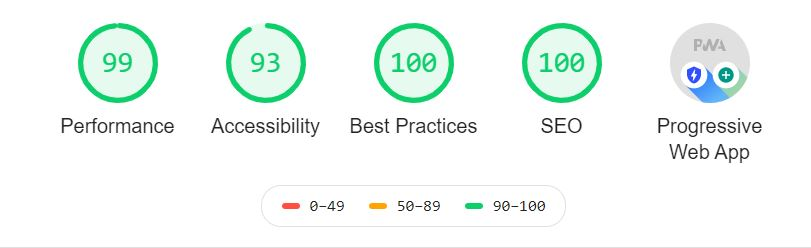

<div align="center"  style="margin-bottom:30px">
    
</div>

<!-- <div align="center">
    <a href='https://www.codacy.com?utm_source=github.com&amp;utm_medium=referral&amp;utm_content=mishal23/gatsby-starter-fresh&amp;utm_campaign=Badge_Grade'>
      
    </a>
    <a href='https://app.netlify.com/sites/gatsby-starter-fresh/deploys'>
      
    </a>
</div> -->

## Features

- built with GatsbyJS, fast loading time, mobile Friendly, in-built contact form powered by Formspree
- [Disqus](https://disqus.com/) support for comments
- SEO friendly
	- option to add meta description
	- Sitemap Generation
	- Twitter tags (Twitter cards)
- Google Analytics

## 🚀 Quick start

```bash
cd gatsby-client/
gatsby develop
```

The site will be running live on ```http://localhost:8000```. 

## Lighthouse Audit Score



## Author

- Salah Osman ([@osman144](https://github.com/osman144))
